## 服务器环境的安装

ajax需要服务器才可以使用的，所以需要在大家的电脑上面先搭建起来一个服务器，供以后的ajax的学习

第一步：

先安装nodejs环境

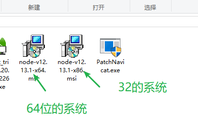

直接双击安装，不要做任何的选择，直接安装在c盘

不要乱安装！！！

等待安装完成就行。

确认环境是否安装成功

打开cmd

在里面输入  `node -v`

回车之后，如果出现一个版本号，就是安装成功了

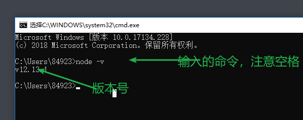

第二步：安装mysql数据库

也是几乎是下一步就行

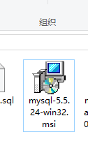

双击打开这个安装包，点击下一步下一步就行

直到这一步：

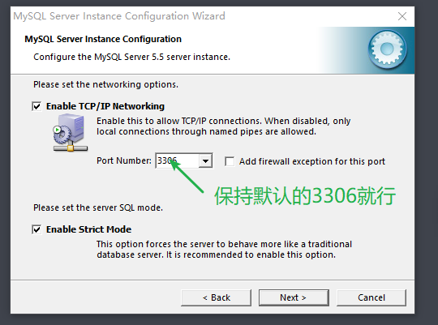

继续点击下一步，直到需要选择编码

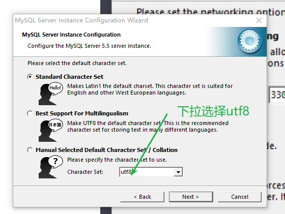

直到需要输入两个密码为止，

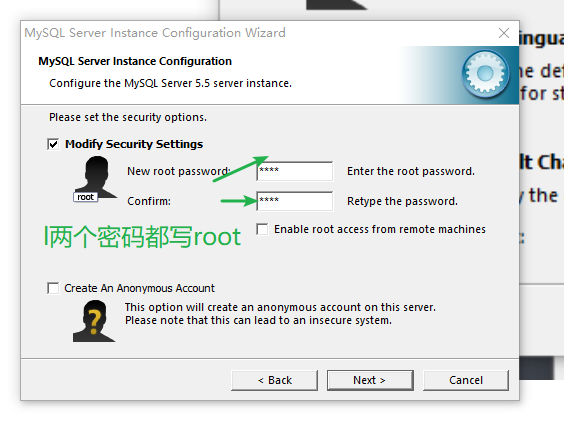

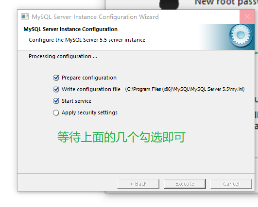

等待安装成功

第三步： 安装数据库管理工具

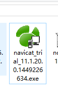

双击就行

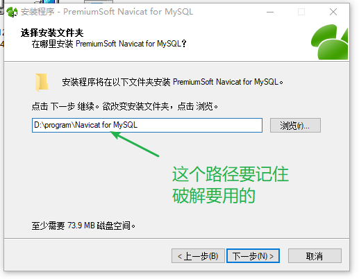

继续点击下一步

继续需要把这个软件先破解

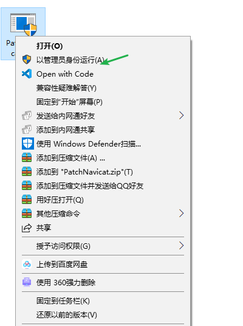

在破解工具上面右键，选中以管理员的身份运行

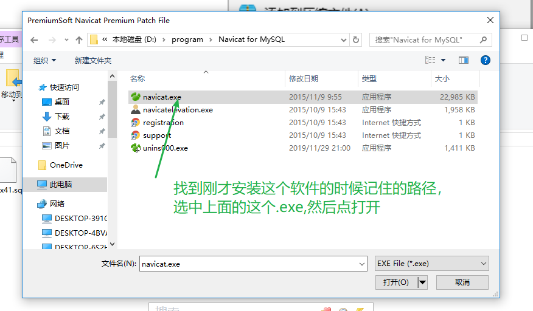

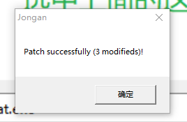

弹出这样的一个框，表示破解成功

第四步： 把数据库建立起来

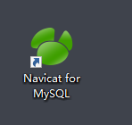

打开这个软件

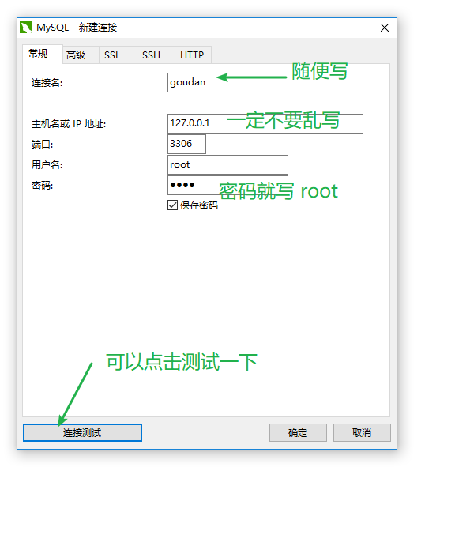

一开始会弹出这样的一个框，按照要求输入

点击链接测试如果成功，就是OK的

之后会在软件的左边，出现一个  `链接`

双击使他变绿

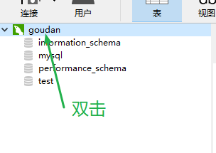

在它身上右键，选择新建数据库

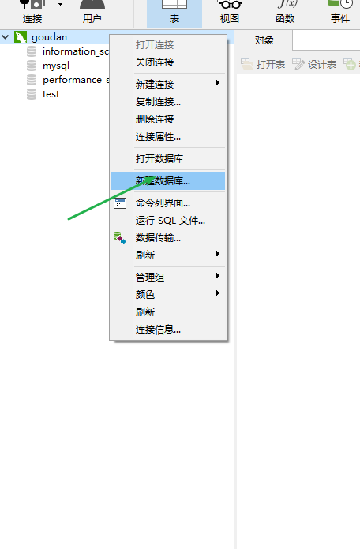

之后会出现一个框

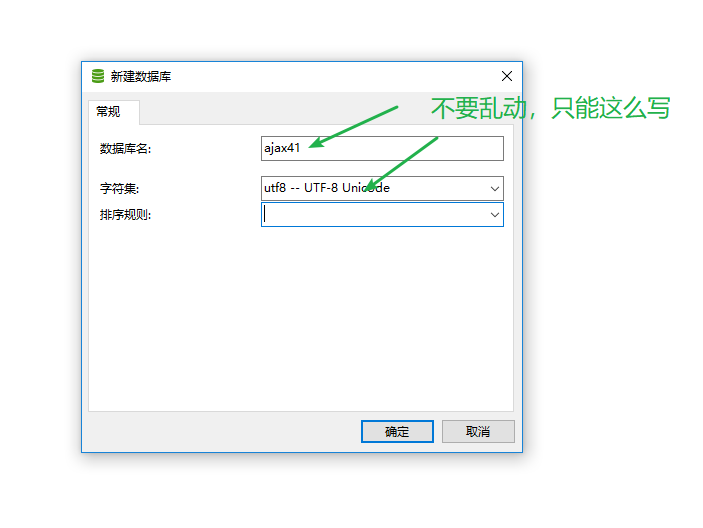

点击确定之后，左边会多一个 `ajax41`的数据库

双击使他变绿，然后在表或则它身上右键

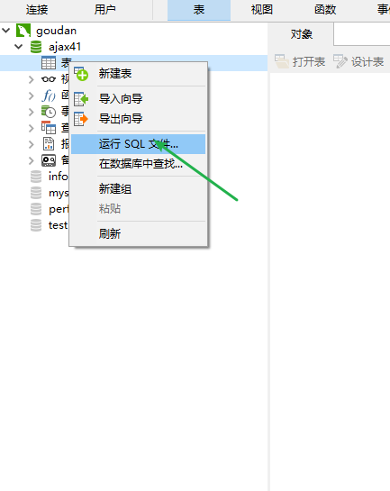

选择运行sql文件

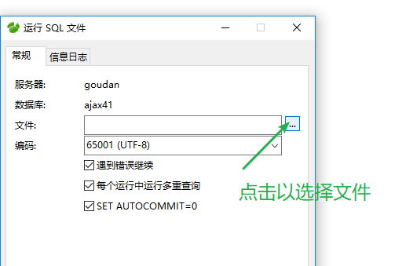

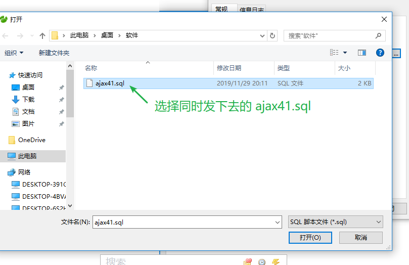

点击开始即可

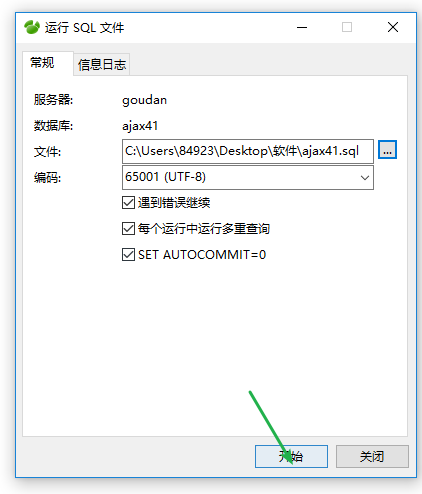

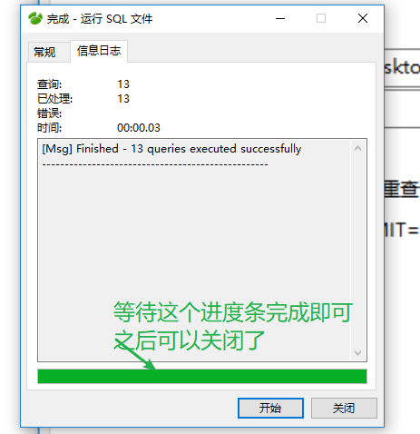

第五步：

尝试启动服务器

打开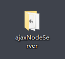

，里面会有一个

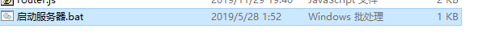

然后双击，如果成功，会出现下面的效果

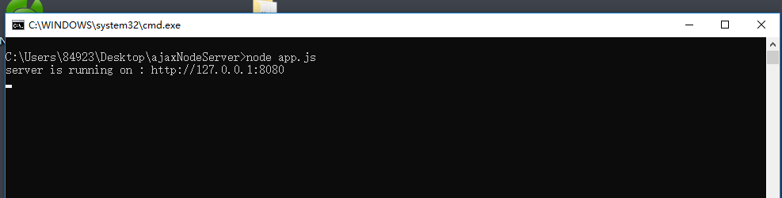

如果不喜欢这个方式，可以使用vscode打开整个文件夹，调出终端，输入指定的命令，回车

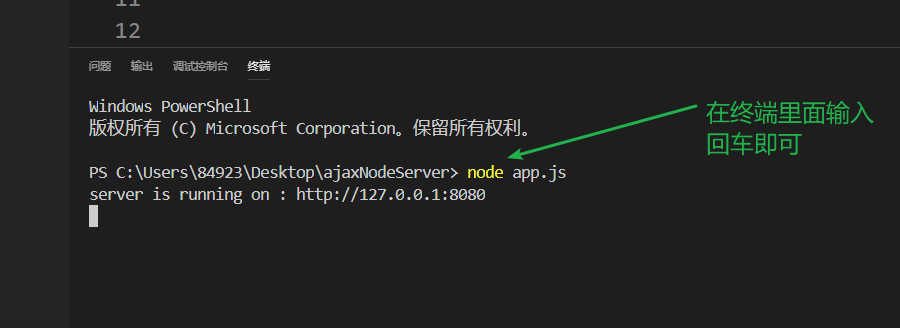